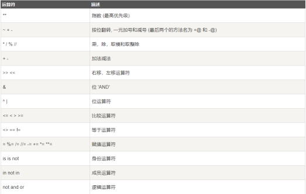

# 1. 环境搭建

 - ## anaconda环境配置
    - anaconda安装官网https://www.anaconda.com/
    - [安装配置指南](https://www.jianshu.com/p/8a20118f4177)
    - anaconda个人理解： anaconda像是python的一个集成环境，以数据科学为主，包含python的多种解释器，可以构建独立构建不同的python依赖环境，具有很高的扩展性。如果说python是胶水语言的话，anaconda就是装胶水的瓶子，能将胶水应用于数据科学，web应用，人工智能，程序设计等各种领域。
 - ## 解释器
	- Python是解释型语言（面向对象）
	  - Python的解释器分类：
	  - CPython（官方）
	  用c语言编写的Python解释器
	  - PyPy
	  用Python语言编写的Python解释器
	  - IronPython
	   用.net编写的Python解释器
	  - Jython
	  用Java编写的Python解释器
	            
# 2.python初体验

## print and input

- print()是python3内置的一个打印函数,作用是将数据以指定的格式输出到标准控制台或指定的文件对象
    - *print 在 Python3.x 是一个函数，但在 Python2.x版本不是一个函数，只是一个关键字。*

- input()用于接收用户从键盘键入的信息（字符串格式）
    - *Python2.x 中 input() 相等于 eval(raw_input(prompt)) ，用来获取控制台的输入。raw_input() 将所有输入作为字符串看待，返回字符串类型。而 input() 在对待纯数字输入时具有自己的特性，它返回所输入的数字的类型（ int, float ）。*

# 3.python基础讲解

## python变量特性+命名规则
### 变量（variable）:
- 变量可以用来保存字面量，并且变量中保存的字面量是不定的变量本身没有任何意思，它会根据不同的字面量表示不同的意思  
- 特性:
- Python中使用变量，不需要声明，直接为变量赋值即可
- Python是一个动态类型的语言，可以为变量赋任意类型的值，也可以任意修改变量的值
### 命名规则：
变量是标识符的一个例子
在Python中所有可以自主命名的内容都属于标识符 比如：变量名、函数名、类名
标识符必须遵循标识符的规范：
  1. 标识符中可以含有字母、数字、_，但是不能使用数字开头
      例子：a_1 _a1 _1a
  2. 标识符不能是Python中的关键字和保留字
      也不建议使用Python中的函数名作为标识符,因为这样会导致函数被覆盖
  3. 命名规范：
      在Python中注意遵循两种命名规范：
          下划线命名法
              所有字母小写，单词之间使用_分割
              max_length min_length hello_world xxx_yyy_zzz
          帕斯卡命名法（大驼峰命名法）  
              首字母大写，每个单词开头字母大写，其余字母小写
              MaxLength MinLength HelloWorld XxxYyyZzz  
      
## 注释方法：
- 单号注释: 单号注释在行头添加`#`即可
```python

# 这是一个注释
print("Hello, World!")

```

- 多行注释 
    - 单引号(''')
    ```python
    '''
	这是多行注释，用三个单引号
	这是多行注释，用三个单引号 
	这是多行注释，用三个单引号
	'''
	print("Hello, World!")
    ``` 

    - 多引号（"""）
    ```python
    """
	这是多行注释，用三个单引号
	这是多行注释，用三个单引号 
	这是多行注释，用三个单引号
	"""
	print("Hello, World!")
    ``` 


## python中“：”作用
- 在列表中用于定义分片、步长
- 一般在函数()后

## 学会使用dir( )及和help( )
dir()列出指定对象或类的属性
help(),括号中输入想要了解的内置函数（BIF）,则输出该函数使用说明  
## import使用
import作为导入语，可以导入各种包等，注意空格

## pep8介绍
不同于C++、C语言等其他汇编语言，Pyhton不使用';'等语句符号来判断一个语句是否完成等操作，而是使用缩进空格的方式进行语句控制。
[Python PEP8 编码规范中文](https://blog.csdn.net/ratsniper/article/details/78954852)
PEP8 是检测编码风格是否符合 PEP 0008 的工具
pip install pip8直接安装
# 4.python数值基本知识

## python中数值类型，int，float，bool，e记法等
### 数值类型（type）
-  整型
-  布尔值(bool)
-  浮点型(float)
-  复数
-  字符串(str)
-  空值
### e记法
 表示10的科学计数法
 比如2e3=2000.0，输出值为浮点型，2e-3=0.002，负数为向后移动小数点
## 算数运算符
运算符可以对一个值或多个值进行运算或各种操作

运算符|描述|实例
---|:--:|---:
+|加，两个对象相加 |a + b 输出结果 30
-|减，得到负数或是一个数减去另一个数|a - b 输出结果 -10
*|乘，两个数相乘或是返回一个被重复若干次的字符串|a * b 输出结果 200
/|除，x除以y|b / a 输出结果 2
%|取模，返回除法的余数|b % a 输出结果 0
"**"|幂，返回x的y次幂a**b|为10的20次方， 输出结果 100000000000000000000
//|取整除 - 返回商的整数部分（向下取整）


## 逻辑运算符
逻辑运算符主要用来做一些逻辑判断
- not 逻辑非
       not可以对符号右侧的值进行非运算
       对于布尔值，非运算会对其进行取反操作，True变False，False变True
       对于非布尔值，非运算会先将其转换为布尔值，然后再取反
      
- and 逻辑与
	   and可以对符号两侧的值进行与运算
	   只有在符号两侧的值都为True时，才会返回True，只要有一个False就返回False
	   与运算是找False的
	   Python中的与运算是短路的与，如果第一个值为False，则不再看第二个值
  
- or 逻辑或
	   or 可以对符号两侧的值进行或运算
	   或运算两个值中只要有一个True，就会返回True
	   或运算是找True的
	   Python中的或运算是短路的或，如果第一个值为True，则不再看第二个值

## 成员运算符
Python成员运算符测试给定值是否为序列中的成员，例如字符串，列表或元组。  
运算符|描述
---|:--:|---:
'in'|如果在指定的序列中找到一个变量的值，则返回true，否则返回false。
'not in'|如果在指定序列中找不到变量的值，则返回true，否则返回false。
## 身份运算符
身份运算符用于比较两个对象的存储单元  

运算符|描述|实例
---|:--:|---:
is|is 是判断两个标识符是不是引用自一个对象|x is y, 类似 id(x) == id(y) , 如果引用的是同一个对象则返回 True，否则返回 False
is not|is not 是判断两个标识符是不是引用自不同对象|x is not y ， 类似 id(a) != id(b)。如果引用的不是同一个对象则返回结果 True，否则返回 False。

## 运算符优先级
- 和数学中一样，在Python运算也有优先级，比如先乘除 后加减
- 运算符的优先级可以根据优先级的表格来查询，
- 在表格中位置越靠下的运算符优先级越高，优先级越高的越优先计算
- 如果优先级一样则自左向右计算
- 可以通过小括号来改变运算顺序
- 如果or的优先级高，或者两个运算符的优先级一样高
- 则需要先进行或运算，则运算结果是3
- 如果and的优先级高，则应该先计算与运算


